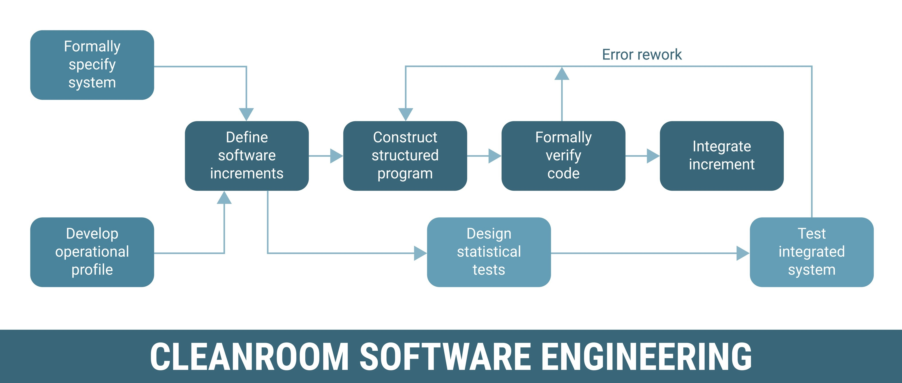

# 1. 오늘 배운 내용

## VSCode_ShortCut_Key
F5 : Debugging, move to next breakpoint
F10 : Debugging One line
ctrl + shift + V : rendering markdown.
ctrl + S : save

## Distribution_To_Git
` git init ` : make file in git
` git add .` : add all file in git
` git commit -m "conventional_commits message_detail"` : save git with message
### Conventional Commits
	feat : make a new feature
	fix : fixed a bug
	docs : change only documents
	style : change only spacing

` https://github.com/qkrwns1714s-web/study_repository.git ` : link my computer to git repository
` git push -u origin main ` : upload to git, save name to origin

` git config --global user.email "your_email@example.com" ` : set my email to git
` git config --global user.name "Your Name" ` : set my name to git

## Python_grammer
### List
` ex_list.append(ex_num)` : append_num

### List_Comprehension
` return [ex_function(ex_num) for ex_num in ex_list] ` : get list of all ex_funtion value about all ex_list elements.
### Set
` ex_set = set() ` : make_set
` ex_set = set(text)` : insert all text Character when make set
` sorted_set = sort(ex_set) ` : sort set by Ascending 

### Function
` def ex_function(insert_value): ` : define function

### Enumerate
` for index, value in enumerate(ex_list) ` : extract all character with index.

### Dictionary
` ex_dictionary = {} ` : make_dic
` ex_dictionary[key] = value ` : insert_value

### Join
` ex_end_string = " ".join(ex_start_string)` : "h e l l o"

# 2. 오늘 배운 용어

## rendering
make codes to image, document, screen.

## Tokenizer
Translator which is using in Encoding, Decoding

### 1. Tokenization
	devide sentence by Token
		it could be Character, Word or Subword

### 2. Vocabulary
	 erase all duplication Character, and make dictionary contain all token

### 3. Mapping
	mapping all token ID

## Encoding, Decoding
Encoding : Human to Computer language
Decoding : Computer language to Human

## Debugging

Procedure which is Find a bug in our code, and fix it.

# 3. 오늘 구현한 것

## real_code_about_Tokenizer

if you want to Learning for another text, change text = "hello world" variable in second line.

```
#sort_text
text = "hello world"
vocab = set(text)
sorted_vocab = sorted(vocab)


#make stoi and itos
stoi = {}
for index, value in enumerate(sorted_vocab):
    stoi[value] = index

itos = sorted_vocab


#make encode, decode functions
def encode(insert_text):
    return [stoi[character] for character in insert_text]

def decode(insert_num):
    return "".join([itos[to_change_num] for to_change_num in insert_num])


#print
print(sorted_vocab)
print(encode("world"), decode([7, 5, 6, 4, 1]))

```


results
[' ', 'd', 'e', 'h', 'l', 'o', 'r', 'w']
[7, 5, 6, 4, 1] world
